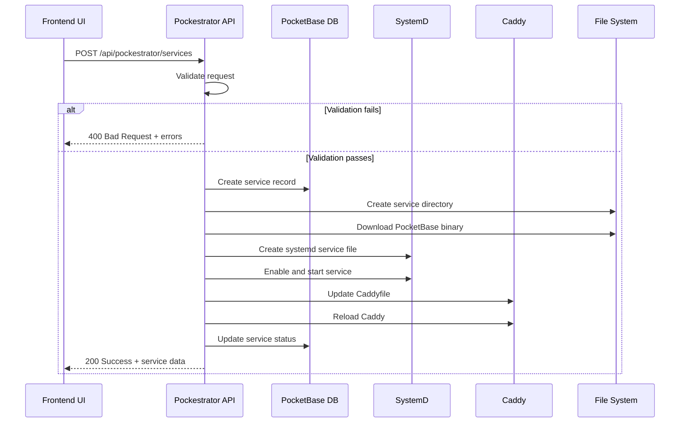
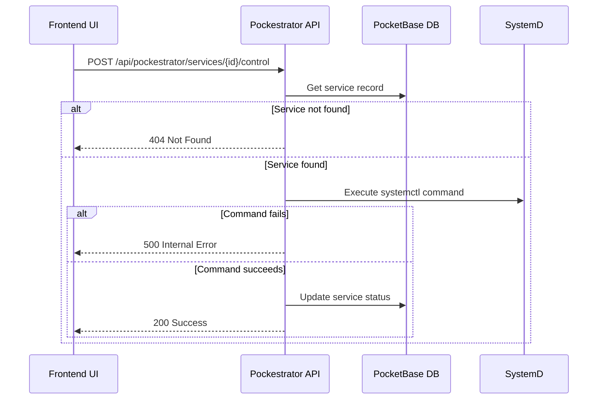
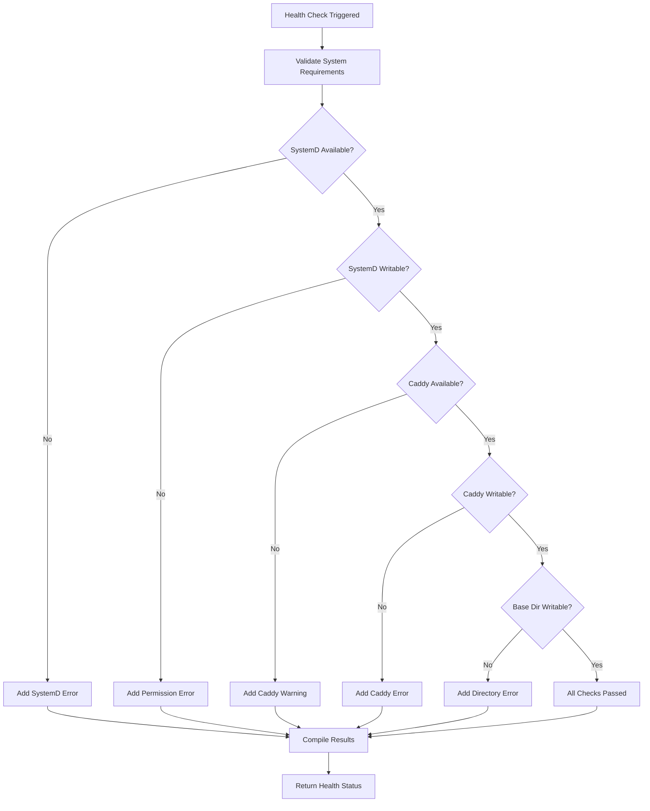

# Pockestrator API Documentation

This document provides comprehensive documentation for all Pockestrator API endpoints, their request/response formats, operational flows, and system requirements.

## 🚀 Overview

Pockestrator is a comprehensive PocketBase service orchestrator that manages deployment, systemd services, Caddy reverse proxy configuration, and provides a REST API for service management. It includes a React dashboard embedded in the Go binary.

**Base URL**: `http://localhost:8091/api/pockestrator`

## 🔐 Authentication

All endpoints require authentication. Use PocketBase authentication tokens in the `Authorization` header:
```
Authorization: Bearer <your-token>
```

## 🏗️ System Architecture

```
┌─────────────────┐    ┌──────────────────┐    ┌─────────────────┐
│   React UI      │────│  Go Binary       │────│  PocketBase     │
│  (Embedded)     │    │  (Orchestrator)  │    │   Instance      │
└─────────────────┘    └──────────────────┘    └─────────────────┘
                              │
        ┌─────────────────────┼─────────────────────┐
        │                     │                     │
   ┌────▼────┐         ┌─────▼─────┐         ┌─────▼─────┐
   │ SystemD │         │   Caddy   │         │   File    │
   │Manager  │         │ Manager   │         │  System   │
   └─────────┘         └───────────┘         └───────────┘
```

## 🛡️ Permission Model

Pockestrator requires elevated permissions for system operations:

- **SystemD Operations**: All systemctl commands use `sudo`
- **Caddy Configuration**: File writes to `/etc/caddy/Caddyfile` require root
- **Service Files**: Creating/modifying service files in `/lib/systemd/system/`
- **Directory Creation**: Service directories in `/home/ubuntu/`

### Required Sudo Permissions

The user running Pockestrator should have these sudo privileges:
```bash
# Add to sudoers file (/etc/sudoers.d/pockestrator)
pockestrator ALL=(ALL) NOPASSWD: /bin/systemctl, /usr/bin/systemctl
pockestrator ALL=(ALL) NOPASSWD: /bin/journalctl, /usr/bin/journalctl
pockestrator ALL=(ALL) NOPASSWD: /usr/bin/systemd-analyze
```

---

## 📊 System Management Endpoints

### 1. System Information
**GET** `/api/pockestrator/system/info`

Returns system configuration and runtime information.

**Response:**
```json
{
  "version": "1.0.0",
  "uptime": "2h30m15s",
  "config": {
    "base_dir": "/home/ubuntu",
    "systemd_dir": "/lib/systemd/system", 
    "caddy_config": "/etc/caddy/Caddyfile",
    "default_domain": "tigawanna.vip"
  }
}
```

### 2. System Health Check
**GET** `/api/pockestrator/system/health`

Performs comprehensive system health validation.

**Response (200 - Healthy):**
```json
{
  "healthy": true,
  "checks": {
    "systemd": true,
    "caddy": true,
    "permissions": true
  },
  "errors": [],
  "warnings": []
}
```

**Response (503 - Unhealthy):**
```json
{
  "healthy": false,
  "checks": {
    "systemd": false,
    "caddy": false,
    "permissions": false
  },
  "errors": [
    {
      "field": "system",
      "message": "Cannot write to systemd directory: permission denied",
      "code": "SYSTEMD_DIR_NOT_WRITABLE"
    }
  ],
  "warnings": [
    {
      "field": "system",
      "message": "Caddy is not installed or not in PATH",
      "code": "MISSING_CADDY"
    }
  ]
}
```

---

## 🔧 Service Management Endpoints

### 1. Create Service
**POST** `/api/pockestrator/services`

Creates and deploys a new PocketBase service with full orchestration.

**Request Body:**
```json
{
  "project_name": "my-app",
  "port": 8080,
  "pocketbase_version": "0.29.0",
  "domain": "my-app.example.com",
  "created_by": "admin@pockestrator.local"
}
```

**Response (200):**
```json
{
  "id": "abc123def456",
  "status": "success",
  "message": "Service created successfully",
  "data": {
    "id": "abc123def456",
    "project_name": "my-app",
    "port": 8080,
    "pocketbase_version": "0.29.0", 
    "domain": "my-app.example.com",
    "status": "deploying",
    "created_by": "admin@pockestrator.local",
    "created_at": "2025-07-31T19:30:00Z",
    "updated_at": "2025-07-31T19:30:00Z"
  }
}
```

**Error Response (400):**
```json
{
  "id": "",
  "status": "error",
  "message": "Validation failed",
  "errors": [
    {
      "field": "project_name",
      "message": "Project name already exists",
      "code": "DUPLICATE_PROJECT_NAME"
    },
    {
      "field": "port",
      "message": "Port 8080 is already in use",
      "code": "PORT_IN_USE"
    }
  ]
}
```

### 2. List Services
**GET** `/api/pockestrator/services`

Retrieves all managed services.

**Query Parameters:**
- `status` (optional): Filter by status (`active`, `inactive`, `error`, `deploying`)
- `domain` (optional): Filter by domain
- `limit` (optional): Limit results (default: 50)
- `offset` (optional): Offset for pagination

**Response:**
```json
{
  "services": [
    {
      "id": "abc123def456",
      "project_name": "my-app",
      "port": 8080,
      "pocketbase_version": "0.29.0",
      "domain": "my-app.example.com",
      "status": "active",
      "created_by": "admin@pockestrator.local",
      "created_at": "2025-07-31T19:30:00Z",
      "updated_at": "2025-07-31T19:35:00Z"
    }
  ],
  "total": 1
}
```

### 3. Get Service Details
**GET** `/api/pockestrator/services/{id}`

Retrieves detailed information about a specific service.

**Response:**
```json
{
  "id": "abc123def456",
  "status": "success",
  "message": "Service retrieved successfully",
  "data": {
    "id": "abc123def456",
    "project_name": "my-app",
    "port": 8080,
    "pocketbase_version": "0.29.0",
    "domain": "my-app.example.com",
    "status": "active",
    "created_by": "admin@pockestrator.local",
    "created_at": "2025-07-31T19:30:00Z",
    "updated_at": "2025-07-31T19:35:00Z"
  }
}
```

### 4. Delete Service
**DELETE** `/api/pockestrator/services/{id}`

Completely removes a service including systemd service, Caddy config, and files.

**Response:**
```json
{
  "id": "abc123def456",
  "status": "success",
  "message": "Service deleted successfully"
}
```

### 5. Service Control Operations
**POST** `/api/pockestrator/services/{id}/control`

Controls service lifecycle (start, stop, restart).

**Request Body:**
```json
{
  "action": "start"  // Options: "start", "stop", "restart"
}
```

**Response:**
```json
{
  "id": "abc123def456",
  "status": "success",
  "message": "Service started successfully"
}
```

### 6. Get Service Status
**GET** `/api/pockestrator/services/{id}/status`

Gets real-time service status from systemd.

**Response:**
```json
{
  "service_id": "abc123def456",
  "project_name": "my-app",
  "systemd_status": "active",
  "is_running": true,
  "last_checked": "2025-07-31T19:45:00Z",
  "error_message": null
}
```

### 7. Get Service Logs
**GET** `/api/pockestrator/services/{id}/logs`

Retrieves systemd journal logs for the service.

**Query Parameters:**
- `lines` (optional): Number of log lines to retrieve (default: 100)

**Response:**
```json
{
  "service_id": "abc123def456",
  "project_name": "my-app",
  "lines": 100,
  "logs": [
    "2025-07-31 19:30:15 [INFO] PocketBase server started",
    "2025-07-31 19:30:15 [INFO] Server listening on 127.0.0.1:8080",
    "2025-07-31 19:30:16 [INFO] Database connected successfully"
  ],
  "timestamp": "2025-07-31T19:45:00Z"
}
```

---

## ✅ Validation Endpoints

### 1. Validate Service Configuration
**POST** `/api/pockestrator/validate/service`

Validates a service configuration before creation.

**Request Body:**
```json
{
  "project_name": "my-app",
  "port": 8080,
  "pocketbase_version": "0.29.0",
  "domain": "my-app.example.com"
}
```

**Response (200 - Valid):**
```json
{
  "valid": true,
  "errors": [],
  "warnings": []
}
```

**Response (400 - Invalid):**
```json
{
  "valid": false,
  "errors": [
    {
      "field": "project_name",
      "message": "Project name already exists",
      "code": "DUPLICATE_PROJECT_NAME"
    }
  ],
  "warnings": [
    {
      "field": "pocketbase_version",
      "message": "Version 0.29.0 is not the latest",
      "code": "VERSION_NOT_LATEST"
    }
  ]
}
```

### 2. Validate System Requirements
**GET** `/api/pockestrator/validate/system`

Validates system prerequisites and permissions.

**Response:**
```json
{
  "is_valid": true,
  "errors": [],
  "warnings": [],
  "checks": {
    "systemd_available": true,
    "systemd_writable": true,
    "caddy_available": true,
    "caddy_writable": true,
    "base_directory_writable": true,
    "required_tools": {
      "systemctl": true,
      "journalctl": true,
      "caddy": true
    }
  }
}
```

---
**GET** `/api/pockestrator/system/info`

Returns system configuration and runtime information.

**Response:**
```json
{
  "version": "1.0.0",
  "uptime": "2h30m15s",
  "config": {
    "base_dir": "/home/ubuntu",
    "systemd_dir": "/lib/systemd/system", 
    "caddy_config": "/etc/caddy/Caddyfile",
    "default_domain": "example.com"
  }
}
```

### 2. System Health Check
**GET** `/api/pockestrator/system/health`

Performs comprehensive system health validation.

**Response (Healthy):**
```json
{
  "healthy": true,
  "checks": {
    "systemd": true,
    "caddy": true,
    "permissions": true
  },
  "errors": [],
  "warnings": []
}
```

**Response (Unhealthy - 503 status):**
```json
{
  "healthy": false,
  "checks": {
    "systemd": false,
    "caddy": false,
    "permissions": false
  },
  "errors": [
    {
      "field": "system",
      "message": "Cannot write to systemd directory",
      "code": "SYSTEMD_DIR_NOT_WRITABLE"
    }
  ],
  "warnings": [
    {
      "field": "system", 
      "message": "Caddy is not installed or not in PATH",
      "code": "MISSING_CADDY"
    }
  ]
}
```

### 3. System Requirements Validation
**GET** `/api/pockestrator/validate/system`

Validates system prerequisites for running Pockestrator.

**Response:**
```json
{
  "is_valid": false,
  "errors": [
    {
      "field": "system",
      "message": "Cannot write to systemd directory: permission denied",
      "code": "SYSTEMD_DIR_NOT_WRITABLE"
    },
    {
      "field": "system", 
      "message": "Cannot write to base directory: permission denied",
      "code": "BASE_DIR_NOT_WRITABLE"
    }
  ],
  "warnings": [
    {
      "field": "system",
      "message": "Caddy is not installed or not in PATH", 
      "code": "MISSING_CADDY"
    },
    {
      "field": "system",
      "message": "Cannot write to Caddyfile: file does not exist",
      "code": "CADDYFILE_NOT_WRITABLE"
    }
  ]
}
```

---

## 🛠️ Service Management Endpoints

### 1. Create Service
**POST** `/api/pockestrator/services`

Creates and deploys a new PocketBase service.

**Request Body:**
```json
{
  "project_name": "my-app",
  "port": 8080,
  "pocketbase_version": "0.29.0",
  "domain": "my-app.example.com",
  "superuser_email": "admin@example.com",
  "description": "My awesome PocketBase app"
}
```

**Response (201):**
```json
{
  "service": {
    "id": "abc123def456",
    "project_name": "my-app",
    "port": 8080,
    "pocketbase_version": "0.29.0", 
    "domain": "my-app.example.com",
    "status": "deploying",
    "created_by": "admin@pockestrator.local",
    "created_at": "2025-07-31T19:30:00Z",
    "updated_at": "2025-07-31T19:30:00Z"
  },
  "systemd": {
    "service_name": "my-app-pocketbase.service",
    "status": "created"
  },
  "caddy": {
    "domain": "my-app.example.com",
    "status": "configured"
  },
  "message": "Service created successfully"
}
```

**Error Response (400):**
```json
{
  "error": "Validation failed",
  "details": {
    "project_name": ["Project name already exists"],
    "port": ["Port 8080 is already in use"],
    "domain": ["Invalid domain format"]
  }
}
```

### 2. List Services
**GET** `/api/pockestrator/services`

Retrieves all managed services.

**Query Parameters:**
- `status` (optional): Filter by status (`active`, `inactive`, `error`, `deploying`)
- `domain` (optional): Filter by domain
- `limit` (optional): Limit results (default: 50)
- `offset` (optional): Offset for pagination

**Response:**
```json
{
  "services": [
    {
      "id": "abc123def456",
      "project_name": "my-app",
      "port": 8080,
      "pocketbase_version": "0.29.0",
      "domain": "my-app.example.com", 
      "status": "active",
      "systemd_config_hash": "a1b2c3d4e5f6",
      "caddy_config_hash": "f6e5d4c3b2a1",
      "last_health_check": "2025-07-31T19:25:00Z",
      "created_by": "admin@pockestrator.local",
      "created_at": "2025-07-31T19:00:00Z",
      "updated_at": "2025-07-31T19:25:00Z",
      "description": "My awesome PocketBase app"
    }
  ],
  "total": 1
}
```

### 3. Get Service Details
**GET** `/api/pockestrator/services/{id}`

Retrieves detailed information about a specific service.

**Response:**
```json
{
  "service": {
    "id": "abc123def456",
    "project_name": "my-app",
    "port": 8080,
    "pocketbase_version": "0.29.0",
    "domain": "my-app.example.com",
    "status": "active",
    "systemd_config_hash": "a1b2c3d4e5f6",
    "caddy_config_hash": "f6e5d4c3b2a1", 
    "last_health_check": "2025-07-31T19:25:00Z",
    "created_by": "admin@pockestrator.local",
    "created_at": "2025-07-31T19:00:00Z",
    "updated_at": "2025-07-31T19:25:00Z",
    "description": "My awesome PocketBase app"
  },
  "runtime_status": {
    "is_running": true,
    "systemd_status": "active",
    "caddy_status": "configured",
    "config_match": true,
    "last_checked": "2025-07-31T19:25:00Z",
    "error_message": null
  }
}
```

### 4. Delete Service  
**DELETE** `/api/pockestrator/services/{id}`

Completely removes a service including systemd service, Caddy config, and files.

**Response:**
```json
{
  "service": {
    "id": "abc123def456", 
    "project_name": "my-app",
    "status": "deleted"
  },
  "systemd": {
    "service_name": "my-app-pocketbase.service",
    "status": "removed"
  },
  "caddy": {
    "domain": "my-app.example.com",
    "status": "removed"
  },
  "message": "Service deleted successfully"
}
```

---

## 🎛️ Service Control Endpoints

### 1. Control Service (Start/Stop/Restart)
**POST** `/api/pockestrator/services/{id}/control`

Controls service execution (start, stop, restart).

**Request Body:**
```json
{
  "action": "start" // or "stop", "restart"
}
```

**Response:**
```json
{
  "service": {
    "id": "abc123def456",
    "project_name": "my-app", 
    "status": "active"
  },
  "action": "start",
  "systemd": {
    "status": "active",
    "message": "Service started successfully"
  },
  "message": "Service control completed successfully"
}
```

### 2. Get Service Status
**GET** `/api/pockestrator/services/{id}/status`

Gets real-time status of a service.

**Response:**
```json
{
  "service_id": "abc123def456",
  "is_running": true,
  "systemd_status": "active",
  "caddy_status": "configured", 
  "config_match": true,
  "last_checked": "2025-07-31T19:30:00Z",
  "error_message": null,
  "pid": 12345,
  "memory_usage": "45.2MB",
  "cpu_usage": "2.1%"
}
```

### 3. Get Service Logs
**GET** `/api/pockestrator/services/{id}/logs`

Retrieves service logs from systemd journal.

**Query Parameters:**
- `lines` (optional): Number of log lines to retrieve (default: 100)
- `follow` (optional): Whether to follow logs in real-time (default: false)
- `since` (optional): Retrieve logs since timestamp (ISO 8601)

**Response:**
```json
{
  "logs": [
    {
      "timestamp": "2025-07-31T19:30:15Z",
      "level": "INFO", 
      "message": "Server started at http://localhost:8080",
      "source": "pocketbase"
    },
    {
      "timestamp": "2025-07-31T19:30:10Z",
      "level": "INFO",
      "message": "Database migration completed",
      "source": "pocketbase" 
    }
  ],
  "total_lines": 2,
  "service_id": "abc123def456",
  "retrieved_at": "2025-07-31T19:30:30Z"
}
```

---

## ✅ Validation Endpoints

### 1. Validate Service Configuration
**POST** `/api/pockestrator/validate/service`

Validates service configuration before creation.

**Request Body:**
```json
{
  "project_name": "my-app",
  "port": 8080,
  "pocketbase_version": "0.29.0",
  "domain": "my-app.example.com"
}
```

**Response:**
```json
{
  "valid": true,
  "errors": [],
  "warnings": [],
  "checks": {
    "project_name_available": true,
    "port_available": true,
    "domain_valid": true,
    "version_exists": true
  }
}
```

**Response (Invalid):**
```json
{
  "valid": false,
  "errors": [
    {
      "field": "project_name",
      "message": "Project name 'my-app' already exists",
      "code": "PROJECT_NAME_EXISTS"
    },
    {
      "field": "port", 
      "message": "Port 8080 is already in use",
      "code": "PORT_IN_USE"
    }
  ],
  "warnings": [
    {
      "field": "domain",
      "message": "Domain may not be reachable from this server", 
      "code": "DOMAIN_UNREACHABLE"
    }
  ],
  "checks": {
    "project_name_available": false,
    "port_available": false,
    "domain_valid": true,
    "version_exists": true
  }
}
```

---

## 🔄 Operational Flows and Sequences

### Service Creation Flow



### Service Control Flow



### Health Check Flow



### Dashboard Integration Strategy

#### 1. **Initial Setup**
```javascript
// Check system health first
const healthCheck = await fetch('/api/pockestrator/system/health');
if (!healthCheck.ok) {
  // Show system setup wizard
  showSystemSetupWizard();
}

// Load existing services
const services = await fetch('/api/pockestrator/services');
displayServices(services);
```

#### 2. **Service Management**
```javascript
// Create new service with validation
async function createService(serviceData) {
  // Pre-validate
  const validation = await fetch('/api/pockestrator/validate/service', {
    method: 'POST',
    body: JSON.stringify(serviceData)
  });
  
  if (!validation.ok) {
    showValidationErrors(validation.errors);
    return;
  }
  
  // Create service
  const result = await fetch('/api/pockestrator/services', {
    method: 'POST',
    body: JSON.stringify(serviceData)
  });
  
  if (result.ok) {
    refreshServiceList();
  }
}
```

#### 3. **Real-time Updates**
```javascript
// Poll for service status updates
setInterval(async () => {
  const services = await fetch('/api/pockestrator/services');
  updateServiceStatuses(services);
}, 30000); // Every 30 seconds

// Get service logs
async function getServiceLogs(serviceId, lines = 100) {
  const logs = await fetch(`/api/pockestrator/services/${serviceId}/logs?lines=${lines}`);
  return logs.json();
}
```

---
